# Patient Analysis
This notebook is responsible for analyzing the "patient" survey responses that have been collected from this [survey](https://forms.gle/axv3s55uio7RmGZT6)

## Questions that we want to answer

- We want to know how likely it is that users will use a pickup box for prescriptions based on their age range
    - We want to know if our proposed solution will have a high customer acceptance rate
- We want to know what patients believe is the mean acceptable amount of time to wait to pick up prescriptions
    -  We want to have a benchmark by which we can determine if our solution meets the needs of customers.

Import dependencies


```python
# import dependencies
import numpy as np
import matplotlib.pyplot as plt
import scipy.optimize as sci
import pandas as pd
from pathlib import Path
import uuid
from IPython.display import display, HTML

# Some formating options
%config InlineBackend.figure_formats = ['svg']

def disp(df):
    """
    Displays a dataframe as HTML

    Args:
        df (dataframe): Dataframe
    """
    display(HTML(df.to_html()))
    
    

```

Load patient survery data into dataframe


```python
file_path = "./output/patient-survey-data.csv"
df = pd.read_csv(file_path)

display_all_data = False

if display_all_data:
    disp(df)
```

## We want to know how likely it is that users will use a pickup box for prescriptions based on their age range


```python
ages = ["Under 21", "21 - 35", "35 - 40", "40 - 64", "65 +"]
col_name = "How likely are you to use an automated pick-up locker to pick up your prescriptions?"

df_counts = pd.DataFrame()

for idx, age in enumerate(ages):
    frame = df.loc[df["What is your age range?"] == age]
    fig = plt.figure()
    counts = frame[col_name].value_counts()
    counts = counts.to_frame()
    counts.plot.barh()
    plt.suptitle(str("Count of Respondants " + age))
    plt.xlabel("Count of Respondants")
    plt.ylabel("liklihood")
    counts.rename(
        columns={col_name: age},
        inplace=True,
    )
    if idx == 0:
        df_counts = counts

    else:
        df_counts[age] = counts[age]
        df_counts.fillna(0)


df_counts = df_counts.fillna(0)
disp(df_counts)
plt.figure()
df_counts.plot.barh(figsize=(10, 6))
plt.suptitle("Total Count of Liklihood Responses by Age")
plt.xlabel("Count of Respondants")
plt.ylabel("liklihood")

```


<table border="1" class="dataframe">
  <thead>
    <tr style="text-align: right;">
      <th></th>
      <th>Under 21</th>
      <th>21 - 35</th>
      <th>35 - 40</th>
      <th>40 - 64</th>
      <th>65 +</th>
    </tr>
  </thead>
  <tbody>
    <tr>
      <th>Very likely</th>
      <td>65</td>
      <td>438</td>
      <td>165</td>
      <td>57</td>
      <td>3</td>
    </tr>
    <tr>
      <th>Somewhat likely</th>
      <td>48</td>
      <td>441</td>
      <td>233</td>
      <td>70</td>
      <td>8</td>
    </tr>
    <tr>
      <th>Likely</th>
      <td>45</td>
      <td>479</td>
      <td>270</td>
      <td>89</td>
      <td>6</td>
    </tr>
    <tr>
      <th>Not very likely</th>
      <td>35</td>
      <td>199</td>
      <td>59</td>
      <td>45</td>
      <td>3</td>
    </tr>
    <tr>
      <th>Never</th>
      <td>10</td>
      <td>33</td>
      <td>10</td>
      <td>16</td>
      <td>7</td>
    </tr>
  </tbody>
</table>


    Text(0, 0.5, 'liklihood')


    <Figure size 432x288 with 0 Axes>


    
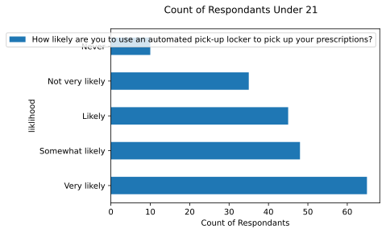
    


    <Figure size 432x288 with 0 Axes>


    
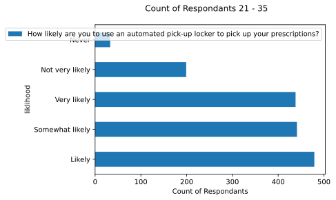
    


    <Figure size 432x288 with 0 Axes>


    
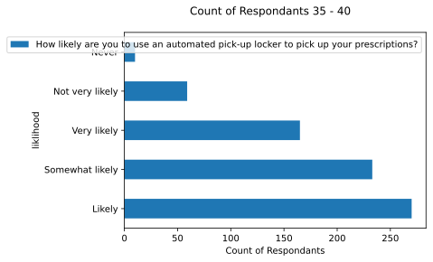
    


    <Figure size 432x288 with 0 Axes>


    
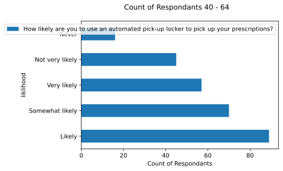
    


    <Figure size 432x288 with 0 Axes>


    
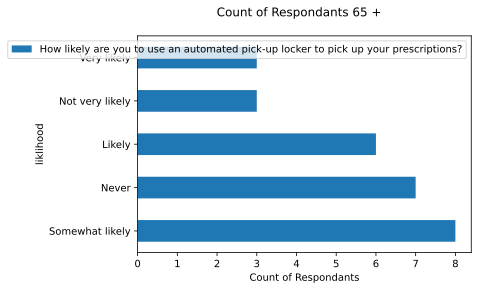
    


    <Figure size 432x288 with 0 Axes>


    
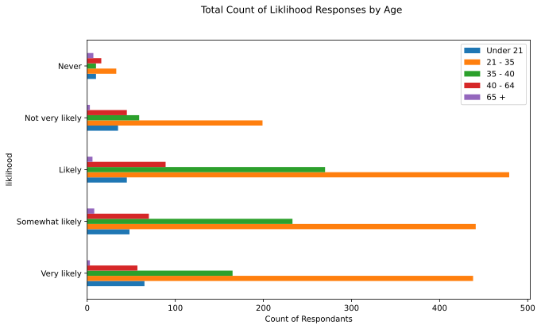
    


```python
df_probs = df_counts
tot_counts = df[col_name].value_counts()
tot_counts = tot_counts.to_frame()

df_probs["All"] = tot_counts[col_name]

df_probs["All"] = df_probs["All"] / np.sum(df_probs["All"])

for age in ages:
    sum = np.sum(df_probs[age])
    df_probs[age] = df_probs[age] / sum

disp(df_probs)
plt.figure()
ax = df_probs.plot.bar(figsize=(10, 6))
plt.suptitle("Likelihood Responses by Age")
plt.ylabel("Probability")
plt.xlabel("Likelihood")
```


<table border="1" class="dataframe">
  <thead>
    <tr style="text-align: right;">
      <th></th>
      <th>Under 21</th>
      <th>21 - 35</th>
      <th>35 - 40</th>
      <th>40 - 64</th>
      <th>65 +</th>
      <th>All</th>
    </tr>
  </thead>
  <tbody>
    <tr>
      <th>Very likely</th>
      <td>0.320197</td>
      <td>0.275472</td>
      <td>0.223881</td>
      <td>0.205776</td>
      <td>0.111111</td>
      <td>0.257052</td>
    </tr>
    <tr>
      <th>Somewhat likely</th>
      <td>0.236453</td>
      <td>0.277358</td>
      <td>0.316147</td>
      <td>0.252708</td>
      <td>0.296296</td>
      <td>0.282087</td>
    </tr>
    <tr>
      <th>Likely</th>
      <td>0.221675</td>
      <td>0.301258</td>
      <td>0.366350</td>
      <td>0.321300</td>
      <td>0.222222</td>
      <td>0.313822</td>
    </tr>
    <tr>
      <th>Not very likely</th>
      <td>0.172414</td>
      <td>0.125157</td>
      <td>0.080054</td>
      <td>0.162455</td>
      <td>0.111111</td>
      <td>0.120240</td>
    </tr>
    <tr>
      <th>Never</th>
      <td>0.049261</td>
      <td>0.020755</td>
      <td>0.013569</td>
      <td>0.057762</td>
      <td>0.259259</td>
      <td>0.026798</td>
    </tr>
  </tbody>
</table>


    Text(0.5, 0, 'Likelihood')


    <Figure size 432x288 with 0 Axes>


    
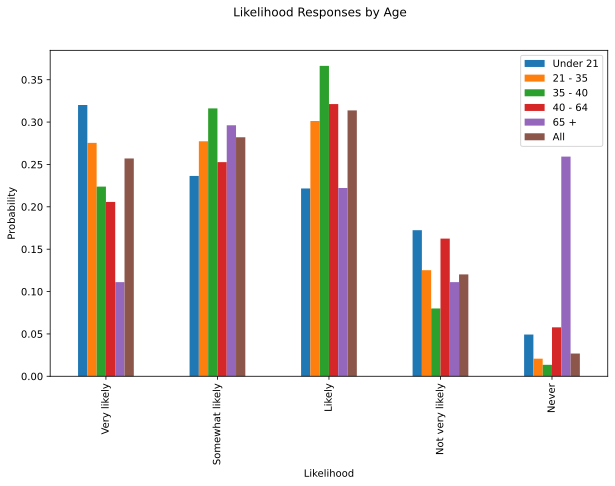
    


```python
plt.figure()
ax = df_probs.plot.density(figsize=(10,6))
plt.suptitle("Density of Response Probability by Age")
plt.xlabel("Probability")
plt.ylabel("Density")
```


    Text(0, 0.5, 'Density')


    <Figure size 432x288 with 0 Axes>


    
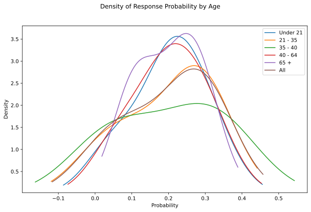
    


## We want to know what patients believe is the mean acceptable amount of time to wait to pick up prescriptions

So we can have a benchmark by which we can determine if our solution meets the needs of customers.


Correlate time ranges to numerical values


```python
df_times = pd.DataFrame()
target_ideal = "What do you think is an acceptable amount of time to wait for services at your pharmacy?"
target_true = "How long do you usually wait at the pharmacy?"
min_ideal_wait_times_val = "Min ideal reported wait times"
min_actual_wait_times_val = "Min actual reported wait times"
max_ideal_wait_times_val = "Max ideal reported wait times"
max_actual_wait_times_val = "Max actual reported wait times"
df_times[min_ideal_wait_times_val] = df[target_ideal]
df_times[min_actual_wait_times_val] = df[target_true]
df_times[max_ideal_wait_times_val] = df[target_ideal]
df_times[max_actual_wait_times_val] = df[target_true]
time_ranges = [
    ["0-3 minutes", 0, 3],
    ["4-6 minutes", 4, 6],
    ["7-9 minutes", 7, 9],
    ["11-15 minutes", 11, 15],
    ["more than 15 minutes", 16, 20],
    ["More than 15 minutes", 16, 20],
    [">16 minutes", 16, 20],
]

for range in time_ranges:
    df_times.loc[
        df_times[min_ideal_wait_times_val] == range[0], min_ideal_wait_times_val
    ] = range[1]
    df_times.loc[
        df_times[min_actual_wait_times_val] == range[0], min_actual_wait_times_val
    ] = range[1]
    df_times.loc[
        df_times[max_ideal_wait_times_val] == range[0], max_ideal_wait_times_val
    ] = range[2]
    df_times.loc[
        df_times[max_actual_wait_times_val] == range[0], max_actual_wait_times_val
    ] = range[2]

mean_min_ideal = np.round(np.mean(df_times[min_ideal_wait_times_val]), 3)
mean_min_actual = np.round(np.mean(df_times[min_actual_wait_times_val]), 3)
mean_max_ideal = np.round(np.mean(df_times[max_ideal_wait_times_val]), 3)
mean_max_actual = np.round(np.mean(df_times[max_actual_wait_times_val]), 3)
stddev_mean_min_ideal = np.round(np.std(df_times[min_ideal_wait_times_val]), 3)
diff_min = abs(mean_min_ideal - mean_min_actual)
diff_max = abs(mean_max_ideal - mean_max_actual)


df_mean_times = pd.DataFrame(
    [
        [mean_min_ideal, mean_max_ideal],
        [mean_min_actual, mean_max_actual],
        [diff_min, diff_max],
    ],
    columns=["Mean Minimum (min)", "Mean Max (min)"],
    index=["Ideal Reported Wait Times", "Actual Reported Wait times", "Difference"],
)
```

Show Table with `min` and `max` desired times


```python
disp(df_mean_times)
```


<table border="1" class="dataframe">
  <thead>
    <tr style="text-align: right;">
      <th></th>
      <th>Mean Minimum (min)</th>
      <th>Mean Max (min)</th>
    </tr>
  </thead>
  <tbody>
    <tr>
      <th>Ideal Reported Wait Times</th>
      <td>6.561</td>
      <td>9.146</td>
    </tr>
    <tr>
      <th>Actual Reported Wait times</th>
      <td>7.675</td>
      <td>10.472</td>
    </tr>
    <tr>
      <th>Difference</th>
      <td>1.114</td>
      <td>1.326</td>
    </tr>
  </tbody>
</table>


Investigate the desity of responses


```python
df_times = df_times.astype(int)

df_times.plot.kde(figsize=(10, 6), subplots=True)


plt.figure()
df_times.plot.hist(alpha=0.5, figsize=(10, 6))

plt.figure()
df_times.plot.box(figsize=(12, 6))
```


    <AxesSubplot: >


    
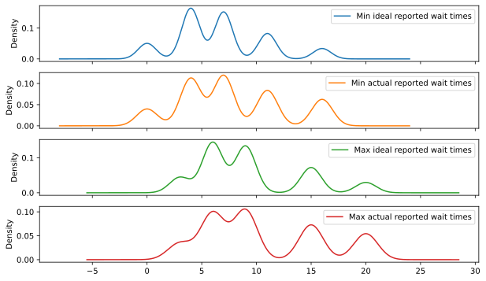
    


    <Figure size 432x288 with 0 Axes>


    
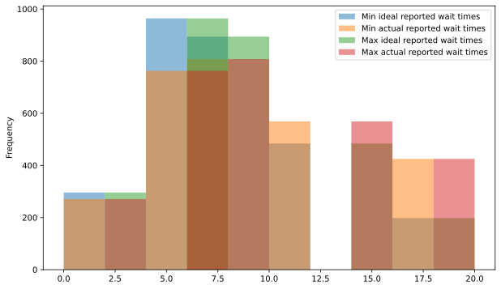
    


    <Figure size 432x288 with 0 Axes>


    
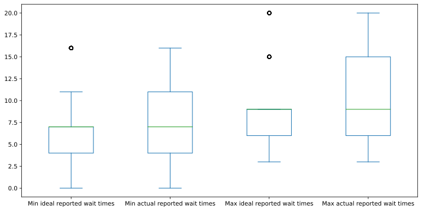
    


```python

```


```python

```
