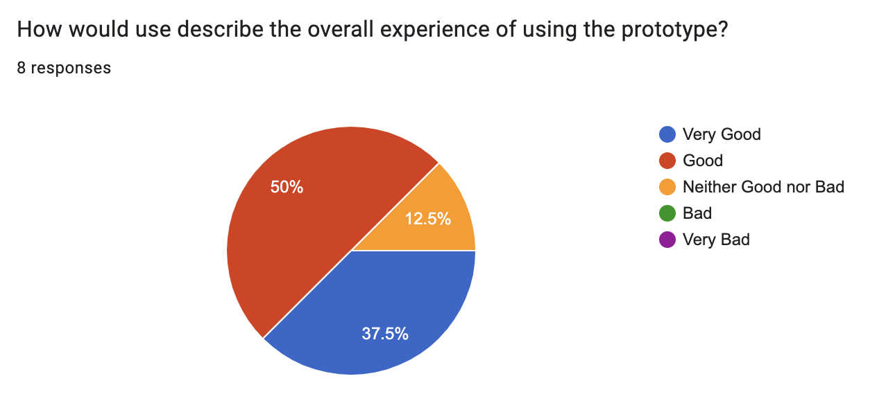
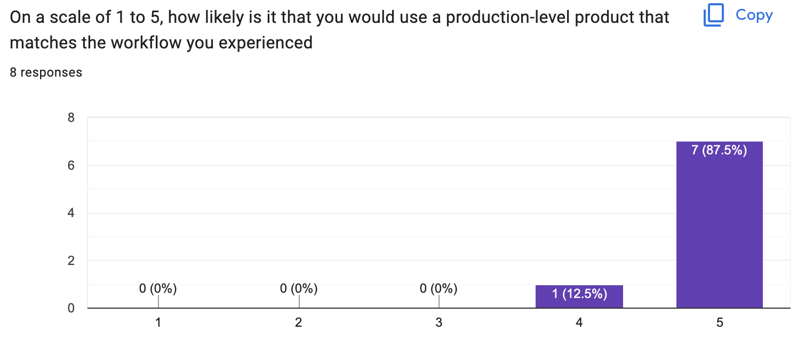

# First Round Patient User Testing Results

## Statistical Findings

### What aspects of the process did you find the most intuitive?

- scanning the QR code
- looked at the screen immediately
- the app was very intuitive, knew where to scan the code
- clicking the QR code was intuitive,
- scanning was intuitive
- the LCD was very intuitive, instructing to open the door
- button for QR code on phone, prompt to scan QR code

### What aspects of the process did you find most confusing?

- if there was anything that I had to do after they picked up the prescription
- where to hold phone relative to the scanner
- knowing when the QR had successfully scanned
- not sure where scanner was, tried to open box wrong way
- not knowing where the camera is and where to place the QR code, and no handle
- Did not know where to scan the QR code
- did not know where to scan the QR code, also did not know where the camera is
- Not sure what the first thing to do is

### In your own words, how could this service be improved?

- confirmation that a pickup has been complete and that there are no other steps needed
- a guide to hold the phone relative to the QR code scanner. would be cool if when you scan the QR code the door would open automatically. The angle at which it was scanner was not ergonomic. wants to be able to see the QR code while scanning
- By adding some additional feedback for when the scan completes, such as when it has gone wrong
- physical prototype could be improved, more distinguished parts, where the scanner is and so on!
- add an LCD to instruct user what do to on box, placing the locker box outside the door
- An interface instructing me where to scan the QR code
- more instructions, feedback like a chime or a prompt that it has been opened.
  improve the process of scanning the QR code

## Notes from User Testing

- Box doesn’t always automatically open
  - The QR code scanning works, and we hear something being triggered, but the spring doesn’t make the front box door open itself
- The interface doesn't update once the box is open and closed
  - You need to refresh to get it to update
    - Patient side is good, once you close the QR code it will move straight to previous pickups.
    - However, when the prescription is created from the staff side, you must refresh the page for it to show up for patients. This is hypothetically okay since we’ll likely email them and the page will be loaded when going to the Pharma-box.
    - For staff though, the “status” of the boxes only updates upon a refresh
- User said he wanted to get confirmation that he picked it up. Once he scanned, he got no feedback on the app. This can be something like closing the QR code automatically and having a popup saying “prescription picked up”
- When Kat from SYDE was testing, she tried scanning the QR code on the actual LCD screen. She had troubles scanning it on it (obviously because it is not a scanner) and then was told to scan at the camera.
- At the camera, she put the phone against the camera, which made it hard to scan. She also had troubles with the phone where the screen would rotate
- Clayton didn’t notice when the box opened
- Clayton also had camera troubles with the QR code
- Have a handle to open the door maybe?
- This user was quick to scan the code (had little troubles)
- The user asked where to open the box
- The box locked again by the time the user asked us how to open it
  - By this time, the code had expired (since it’s a one time code)
- No indication that the door was open
- Had to look for camera, Make it obvious with arrows
- Instructions visible on the box
- Chime when box open, more obvious indication
- Need first instruction

Something I noticed:

- Will the box always be fully closed? The users have closed it but sometimes they may not.

## Feedback from November 16th User Testing Synopsis:

Based on the data provided, it seems that there are a few issues with the current design of Pharma-box. Here are some recommendations to improve the user experience:

1. Make the box opening/closing process more obvious: Users are having trouble understanding when the box has opened and are not receiving any confirmation that their prescription has been picked up.
   1. Consider adding a chime or other sound when the box opens, and make the opening process more visible.
   2. Also, add a pop-up message that confirms when the prescription is picked up since users are not getting any feedback when they pick up the prescription.
   3. Adding a handle to the box could make it easier for users to open and close the box.
   4. Make sure the box is always fully closed: Some users have reported that the box is not always fully closed. Ensure that the box always closes properly and that users are aware of how to close the box correctly.
2. Improve the QR code scanning process: Users are having trouble scanning the QR code, and some are having trouble finding the camera. Make the camera more obvious with arrows or other indicators, and make the instructions for scanning the code more visible on the box. This will prevent accidental scanning on the LCD screen as that was something that happened often.
3. Make the interface more user-friendly: 5. Users are having trouble understanding how to navigate the interface, and they are having trouble refreshing the page to see updates. Consider making the interface more intuitive and easy to use, and make sure that updates are visible without needing to refresh the page. 6. Add a clear indication of the box status: Staff users are having trouble understanding the status of the boxes, and they are having to refresh the page to see updates. Consider adding a clear indication of the box status on the interface, which will make it easier for staff to understand if the box is open or closed.
4. Make the design of the box more attractive: Some users have expressed that the box could look better. Consider making the design of the box more visually appealing, which may also improve user experience.
